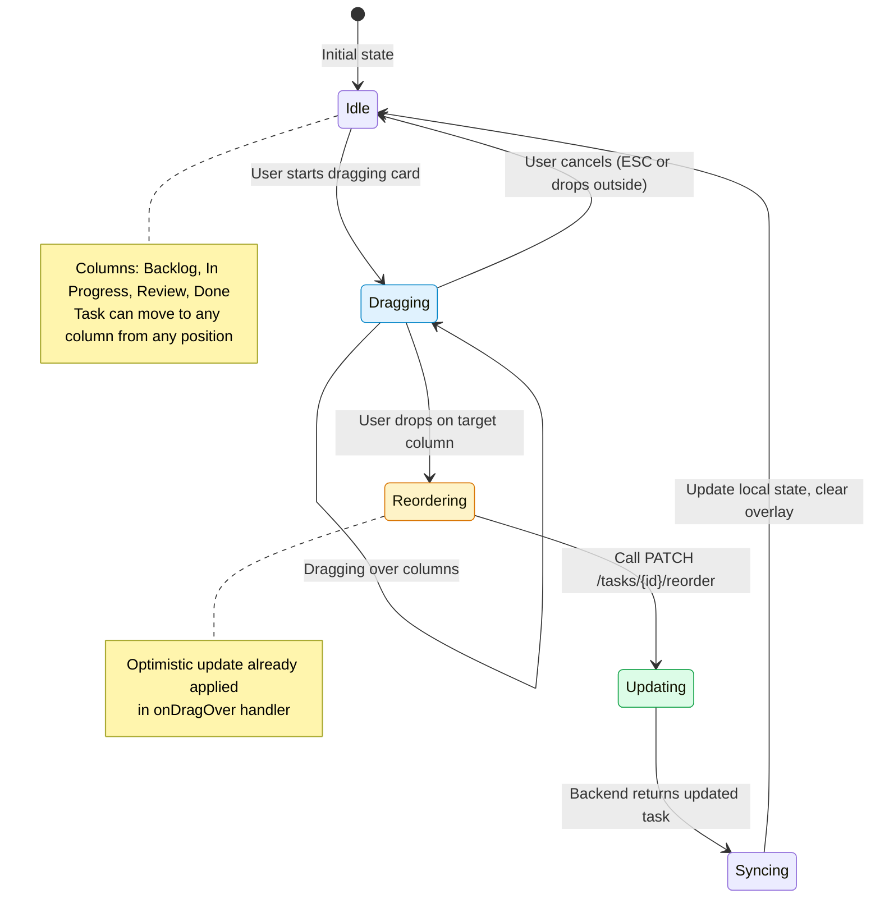
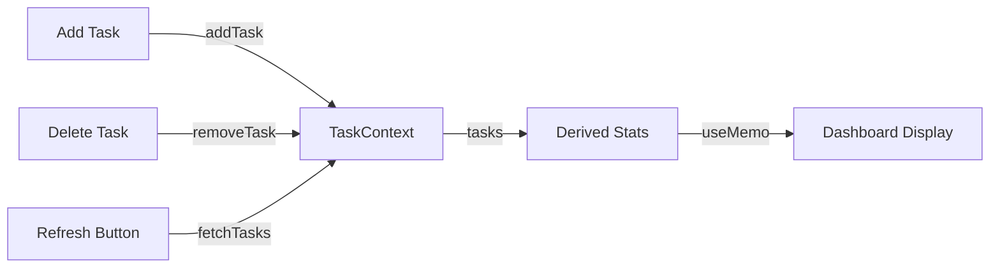
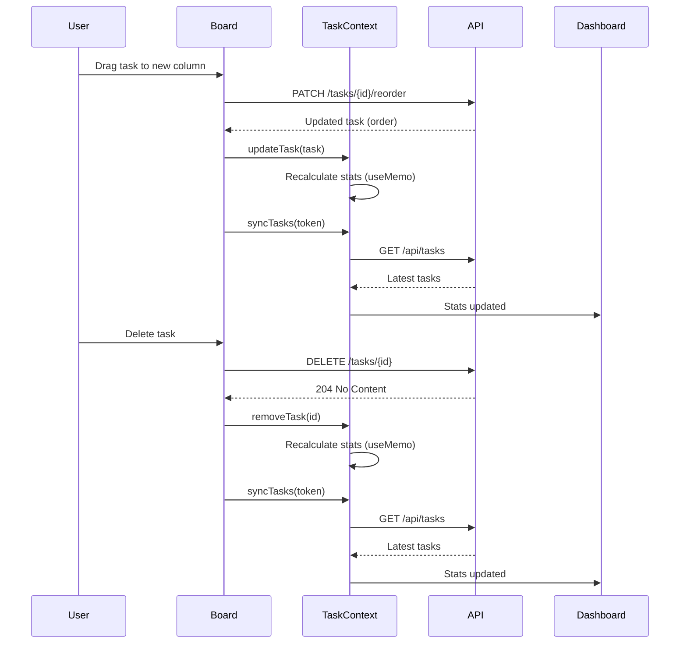

# TaskBoard Pro - Architecture Specification

## Version: 1.2.0 - SYNCED ✅

TaskBoard Pro is a high-performance Kanban board with a premium Glassmorphism UI. Built for portfolio-ready quality with seamless drag-and-drop physics.

- **Frontend:** Next.js 15, React 19, Tailwind CSS, dnd-kit
- **Backend:** FastAPI (Python 3.10+), PostgreSQL
- **Architecture:** REST API with Server Actions for mutations

---

## 2. Scaffolding Commands

### Frontend

```bash
npx create-next-app@latest taskboard \
  --typescript \
  --tailwind \
  --eslint \
  --app \
  --src-dir \
  --import-alias "@/*" \
  --use-npm

cd taskboard
npm install @dnd-kit/core @dnd-kit/sortable @dnd-kit/utilities clsx tailwind-merge
```

### Backend

```bash
mkdir backend && cd backend
python -m venv venv
source venv/bin/activate  # Windows: venv\Scripts\activate
pip install fastapi uvicorn sqlalchemy pydantic psycopg2-binary python-dotenv
```

---

## 3. Folder Structure

```
taskboard/
├── src/
│   ├── app/
│   │   ├── api/
│   │   │   ├── tasks/
│   │   │   │   └── route.ts       # Task CRUD endpoints
│   │   │   └── columns/
│   │   │       └── route.ts       # Column endpoints
│   │   ├── layout.tsx             # Root layout with gradient bg
│   │   ├── page.tsx               # Main Kanban board page
│   │   └── globals.css            # Tailwind + custom glass styles
│   ├── components/
│   │   ├── ui/                    # Atomic glass-themed components
│   │   │   ├── Button.tsx
│   │   │   ├── Modal.tsx
│   │   │   └── Card.tsx
│   │   ├── KanbanBoard.tsx       # dnd-kit context + columns
│   │   ├── Column.tsx            # Droppable column container
│   │   ├── TaskCard.tsx           # Draggable task card
│   │   └── AddTaskModal.tsx       # Glass-themed create modal
│   └── lib/
│       ├── types.ts               # TypeScript interfaces
│       ├── api.ts                 # API client functions
│       └── utils.ts               # cn() utility, helpers
├── tailwind.config.ts
└── package.json

backend/
├── app/
│   ├── api/
│   │   ├── tasks.py               # Task routes
│   │   └── columns.py             # Column routes
│   ├── models/
│   │   ├── task.py                # SQLAlchemy models
│   │   └── column.py
│   ├── schemas/
│   │   ├── task.py                # Pydantic schemas
│   │   └── column.py
│   ├── services/
│   │   └── task_service.py        # Business logic
│   ├── database.py                # SQLAlchemy setup
│   └── main.py                    # FastAPI app
├── .env
└── requirements.txt
```

---

## 4. Data Types

### Naming Convention: task_order

The database uses `task_order` for the task ordering field. The Pydantic schema uses an alias to expose it as `order` in the API response for frontend compatibility.

```python
# Backend Schema (app/schemas/task.py)
class TaskResponse(TaskBase):
    order: int = Field(0, validation_alias="task_order")  # Maps DB field to API response
```

### State Management Strategy

The application uses **React Context** pattern with **Global State** via TaskContext for sharing data between Board and Dashboard views.

**TaskContext (Global State):**
```typescript
// TaskContext.tsx - Global state management
interface TaskContextType {
  tasks: Task[];
  stats: Stats | null;
  isLoading: boolean;
  fetchTasks: (token: string) => Promise<void>;
  fetchStats: (token: string) => Promise<void>;
  addTask: (task: Task, token: string) => Promise<void>;
  removeTask: (taskId: string, token: string) => Promise<void>;
}
```

**Why Global State:**
- Board and Dashboard share the same task data
- Switching views preserves state (no re-fetching)
- Stats automatically sync on task changes

**Optimistic UI Updates:**
- Tasks appear instantly in the Backlog column upon 201 response from POST /tasks
- Drag-and-drop uses optimistic updates via dnd-kit's onDragOver handler
- onDragEnd persists changes via PATCH /tasks/{id}/reorder and syncs state with server response

### TypeScript Interfaces (Frontend)

```typescript
// src/lib/types.ts

export type Priority = 'high' | 'medium' | 'low';

export type ColumnTitle = 'Backlog' | 'In Progress' | 'Review' | 'Done';

export interface Task {
  id: string;
  title: string;
  description?: string;
  priority: Priority;
  columnId: string;
  order: number;
  createdAt: string;  // ISO date string
  updatedAt: string;
}

export interface Column {
  id: string;
  title: ColumnTitle;
  order: number;
  tasks: Task[];
}

export interface CreateTaskPayload {
  title: string;
  description?: string;
  priority: Priority;
  columnId: string;
}

export interface UpdateTaskPayload {
  title?: string;
  description?: string;
  priority?: Priority;
  columnId?: string;
  order?: number;
}

export interface ReorderTasksPayload {
  taskId: string;
  newColumnId: string;
  newOrder: number;
}
```

### Pydantic Schemas (Backend)

```python
# backend/app/schemas/task.py

from pydantic import BaseModel
from typing import Optional
from enum import Enum
from datetime import datetime

class Priority(str, Enum):
    high = "high"
    medium = "medium"
    low = "low"

class TaskBase(BaseModel):
    title: str
    description: Optional[str] = None
    priority: Priority = Priority.medium

class TaskCreate(TaskBase):
    column_id: str

class TaskUpdate(BaseModel):
    title: Optional[str] = None
    description: Optional[str] = None
    priority: Optional[Priority] = None
    column_id: Optional[str] = None
    order: Optional[int] = None

class TaskResponse(TaskBase):
    id: str
    column_id: str
    order: int
    created_at: datetime
    updated_at: datetime

    class Config:
        from_attributes = True
```

---

## 5. API Contracts

### Unified API Prefix

All backend endpoints are prefixed with `/api`:
- Tasks: `/api/tasks`
- Stats: `/api/stats`
- Auth: `/api/auth/login`, `/api/auth/register`

### Tasks

| Method | Endpoint | Description |
|--------|----------|-------------|
| `GET` | `/tasks` | List all tasks |
| `POST` | `/tasks` | Create new task |
| `GET` | `/tasks/{id}` | Get single task |
| `PATCH` | `/tasks/{id}` | Update task |
| `DELETE` | `/tasks/{id}` | Delete task (returns 204 No Content) |
| `PATCH` | `/tasks/{id}/reorder` | Reorder task (move between columns) |
| `PATCH` | `/tasks/{id}/move` | Move task to different column |
| `GET` | `/stats` | Get task statistics (JWT protected) |

### Request/Response Examples

**GET /api/stats**
```json
// Response (200 OK)
{
  "total": 3,
  "by_status": {
    "backlog": 2,
    "in_progress": 1,
    "review": 0,
    "done": 0
  },
  "by_priority_per_status": {
    "backlog": {"high": 1, "medium": 1, "low": 0},
    "in_progress": {"high": 0, "medium": 0, "low": 1},
    "review": {"high": 0, "medium": 0, "low": 0},
    "done": {"high": 0, "medium": 0, "low": 0}
  }
}
```

**PATCH /api/tasks/{id}/reorder**
```json
// Request (Frontend sends camelCase, proxy converts to snake_case)
{
  "newColumnId": "col-2",
  "newOrder": 0
}

// Backend receives
{
  "new_column_id": "col-2",
  "new_order": 0
}

// Response (200 OK)
{
  "id": "task-123",
  "title": "Task title",
  "column_id": "col-2",
  "order": 0,
  ...
}
```

**DELETE /api/tasks/{id}**
```json
// Response: 204 No Content
```
```json
// Request
{
  "title": "Implement login",
  "description": "Add OAuth2 login flow",
  "priority": "high",
  "columnId": "col-1"
}

// Response (201)
{
  "id": "task-123",
  "title": "Implement login",
  "description": "Add OAuth2 login flow",
  "priority": "high",
  "columnId": "col-1",
  "order": 0,
  "createdAt": "2026-03-16T10:00:00Z",
  "updatedAt": "2026-03-16T10:00:00Z"
}
```

**PATCH /api/tasks/reorder**
```json
// Request
{
  "taskId": "task-123",
  "newColumnId": "col-2",
  "newOrder": 1
}
```

---

## 6. Data Flow Diagram

```mermaid
graph TB
    subgraph Frontend["Next.js 15 Frontend"]
        UI[KanbanBoard UI]
        API[API Route Handler<br/>/api/tasks"]
        Store[React State<br/>useState/useOptimistic]
    end

    subgraph Backend["FastAPI Backend"]
        Router["API Router<br/>tasks.py"]
        Service["Task Service"]
        Schema["Pydantic Schemas<br/>task.py"]
    end

    subgraph Database["PostgreSQL"]
        DB[(Tasks Table)]
    end

    UI -->|"1. Render & Fetch"| API
    API -->|"2. Proxy Request"| Router
    Router -->|"3. Validate"| Schema
    Schema -->|"4. Process"| Service
    Service -->|"5. CRUD"| DB
    DB -->|"6. Response"| Service
    Service -->|"7. JSON Response"| Router
    Router -->|"8. JSON"| API
    API -->|"9. Update State"| Store
    Store -->|"10. Re-render"| UI

    style UI fill:#e0f2fe,stroke:#0284c7
    style API fill:#e0f2fe,stroke:#0284c7
    style Router fill:#fef3c7,stroke:#d97706
    style Schema fill:#fef3c7,stroke:#d97706
    style DB fill:#dcfce7,stroke:#16a34a
```

### Flow Description

1. **UI Layer**: KanbanBoard renders four glassmorphism columns
2. **API Route**: Next.js API route proxies requests to backend
3. **Router**: FastAPI router receives HTTP requests
4. **Schema**: Pydantic validates request/response data
5. **Service**: Business logic processes the request
6. **Database**: PostgreSQL stores task data
7. **Response**: Data flows back through the stack

---

## 6b. Drag-and-Drop Sequence Diagram

```mermaid
sequenceDiagram
    participant User
    participant UI as KanbanBoard (Frontend)
    participant DnD as dnd-kit
    participant API as Next.js API
    participant Backend as FastAPI
    
    Note over User,UI: User initiates drag
    
    User->>UI: Click and drag TaskCard
    
    activate DnD
    DnD->>UI: onDragStart event
    UI->>UI: Set activeTask state<br/>Show DragOverlay
    
    User->>UI: Drag over target column
    DnD->>UI: onDragOver event
    UI->>UI: Optimistic update<br/>Move task in local state
    
    User->>UI: Release task
    DnD->>UI: onDragEnd event
    
    UI->>API: PATCH /api/tasks/{id}/reorder<br/>{newColumnId, newOrder}
    
    activate API
    API->>Backend: POST /tasks/{id}/reorder<br/>{newColumnId, newOrder}
    
    activate Backend
    Backend->>Backend: Validate with ReorderTask schema
    Backend->>Backend: Update task in database
    Backend-->>API: Return updated task
    
    deactivate Backend
    
    API-->>UI: Return updated task
    
    deactivate API
    
    UI->>UI: Update state with server response
    
    DnD->>UI: Clear activeTask
    UI->>UI: Hide DragOverlay
    
    Note over User,UI: Task now visible in new column
    
    style UI fill:#e0f2fe,stroke:#0284c7
    style DnD fill:#f0f9ff,stroke:#0ea5e9
    style API fill:#e0f2fe,stroke:#0284c7
    style Backend fill:#fef3c7,stroke:#d97706
```

### Drag-Drop Flow Description

1. **Drag Start**: User clicks and drags a task card
2. **Optimistic Update**: dnd-kit triggers onDragOver, UI updates locally before server confirms
3. **Drag End**: User releases the task
4. **API Call**: Frontend sends PATCH request to reorder endpoint
5. **Backend Update**: FastAPI validates and updates the task
6. **State Sync**: Frontend updates state with server response
7. **Cleanup**: DragOverlay is hidden, UI reflects final state

---

## 6c. Drag-and-Drop State Machine



### State Descriptions

| State | Description |
|-------|-------------|
| **Idle** | Board is static, no drag interaction |
| **Dragging** | User is holding and moving a task card |
| **Reordering** | Task dropped, preparing API call |
| **Syncing** | Waiting for backend confirmation |

---

## 7. dnd-kit Integration Strategy

### Architecture

1. **KanbanBoard.tsx** (Client Component)
   - Wraps entire board in `DndContext`
   - Manages drag state and sensors
   - Handles `onDragEnd` and `onDragOver` events

2. **Column.tsx** (Client Component)
   - Uses `useDroppable` for column container
   - Renders `SortableContext` for task ordering
   - Handles reordering within column

3. **TaskCard.tsx** (Client Component)
   - Uses `useSortable` for drag handle
   - Implements `transform`, `listeners`, `attributes`
   - Applies glassmorphism styling

### Key Implementation Details

```typescript
// KanbanBoard.tsx - DndContext setup
'use client';

import { DndContext, DragOverlay, closestCenter, PointerSensor, KeyboardSensor, useDroppable } from '@dnd-kit/core';
import { sortableKeyboardCoordinates } from '@dnd-kit/sortable';

const sensors = [
  PointerSensor({
    activationConstraint: { distance: 8 },  // Prevent accidental drags
  }),
  KeyboardSensor({
    coordinateGetter: sortableKeyboardCoordinates,
  }),
];

// Collision Detection: closestCenter for empty column drops
// Columns have min-height: 500px and useDroppable for drop targets

function KanbanBoard({ columns }: { columns: Column[] }) {
  const { setNodeRef: setBoardRef } = useDndContext();

  return (
    <DndContext
      sensors={sensors}
      collisionDetection={closestCorners}
      onDragStart={handleDragStart}
      onDragOver={handleDragOver}
      onDragEnd={handleDragEnd}
    >
      <div ref={setBoardRef} className="flex gap-4 p-6 min-h-screen">
        {columns.map(column => (
          <Column key={column.id} column={column} />
        ))}
      </div>
      <DragOverlay>
        {activeTask ? <TaskCard task={activeTask} isOverlay /> : null}
      </DragOverlay>
    </DndContext>
  );
}
```

### Optimistic Updates

Use React 19's `useOptimistic` for instant feedback:

```typescript
// Inside KanbanBoard
const [optimisticColumns, setOptimisticColumns] = useOptimistic(
  columns,
  (state, { taskId, newColumnId, newOrder }) => {
    // Apply optimistic state change
    return updatedColumns;
  }
);
```

### Drag Physics

- **Animation Duration:** 200ms for smooth transitions
- **Activation Distance:** 8px (prevents accidental picks)
- **Collision Detection:** `closestCenter` for reliable drop target detection, including empty columns
- **Empty Column Support:** Columns have `min-height: 500px` and use `useDroppable` hook for drop targets

### Empty Column Drops

To enable dropping tasks into empty columns:
1. Column containers have `min-height: 500px` to provide adequate drop target area
2. `useDroppable` hook is configured on column containers with column ID
3. `closestCenter` collision detection finds the nearest droppable container
4. SortableContext accepts empty items array but still functions as a drop zone

---

## 7. Glassmorphism Guidelines

### Tailwind Classes Reference

```css
/* Base glass effect */
.glass {
  @apply bg-white/40 backdrop-blur-md border border-white/20;
}

/* Column glass */
.column-glass {
  @apply bg-white/30 backdrop-blur-lg rounded-xl border border-white/30;
}

/* Card glass */
.card-glass {
  @apply bg-white/60 backdrop-blur-sm rounded-lg border border-white/40;
}

/* Modal overlay */
.modal-glass {
  @apply bg-black/30 backdrop-blur-md;
}
```

### Color Palette

- **Background:** Soft pastel gradient (mesh or radial)
- **High Priority:** `bg-red-500/80`
- **Medium Priority:** `bg-amber-500/80`
- **Low Priority:** `bg-blue-500/80`

---

## 8. Environment Variables

```env
# Frontend (.env.local)
NEXT_PUBLIC_API_URL=http://localhost:8000

# Backend (.env)
DATABASE_URL=sqlite:///./tasks.db
```

---

## 8b. SQLite Persistence Strategy

The backend uses SQLite for data persistence instead of in-memory storage. This ensures data survives server restarts and page refreshes.

### Database File
- **Location:** `backend/tasks.db`
- **Type:** SQLite3

### Schema
```sql
CREATE TABLE tasks (
    id TEXT PRIMARY KEY,
    title TEXT NOT NULL,
    description TEXT,
    priority TEXT NOT NULL DEFAULT 'medium',
    column_id TEXT NOT NULL,
    task_order INTEGER NOT NULL DEFAULT 0,
    created_at TEXT NOT NULL,
    updated_at TEXT NOT NULL
);
```

### Database Module (`app/database.py`)
The `database.py` module provides:
- `get_db_connection()` - Get SQLite connection
- `init_db()` - Initialize database schema
- `get_all_tasks()` - Get all tasks sorted by column and order
- `get_task_by_id(task_id)` - Get single task
- `create_task(task_data)` - Create new task
- `update_task(task_id, task_data)` - Update task
- `delete_task(task_id)` - Delete task

### Persistence Behavior
- Tasks persist across server restarts
- Data survives browser refresh
- Each test run clears the database via fixtures

---

## 8c. Board-Dashboard Reactive Data Flow

The Dashboard stays **live** and reactive to Board state changes using derived stats.

### TaskContext (Reactive State)
```typescript
// TaskContext.tsx - Derived Stats
const stats = useMemo(() => calculateStats(tasks), [tasks]);

function calculateStats(tasks: Task[]): Stats {
  // Calculate stats from tasks array
  // No API call needed - derived from local state
}
```

### Reactive Flow


### State Updates
1. **Add Task**: Updates local `tasks` array → stats auto-recalculate
2. **Delete Task**: Updates local `tasks` array → stats auto-recalculate  
3. **Move Task**: Updates local `tasks` array → stats auto-recalculate
4. **Manual Refresh**: Calls `fetchTasks()` → updates `tasks` → stats recalculate

### Dashboard Features
- **Auto-reaction**: Stats update automatically when tasks change
- **Refresh Button**: Manual sync with server (with loading spinner)
- **Framer-motion Animations**: Numbers animate on change with spring physics
- **Success Glow**: Stat cards glow green when values change (move/delete events)
- **Event-Driven Sync**: Each Board action (add/move/delete) updates TaskContext → stats recalculate

### Full Sync Cycle


### Cache-Control Headers
The `/api/stats` endpoint includes:
```
Cache-Control: no-cache, no-store, must-revalidate
Pragma: no-cache
Expires: 0
```

---

## 9. Running the Project

```bash
# Frontend (port 3000)
npm run dev

# Backend (port 8000)
uvicorn app.main:app --reload --port 8000

# API Docs
# http://localhost:8000/docs
```

---

*Generated by Orchestrator Agent - 2026-03-17*
