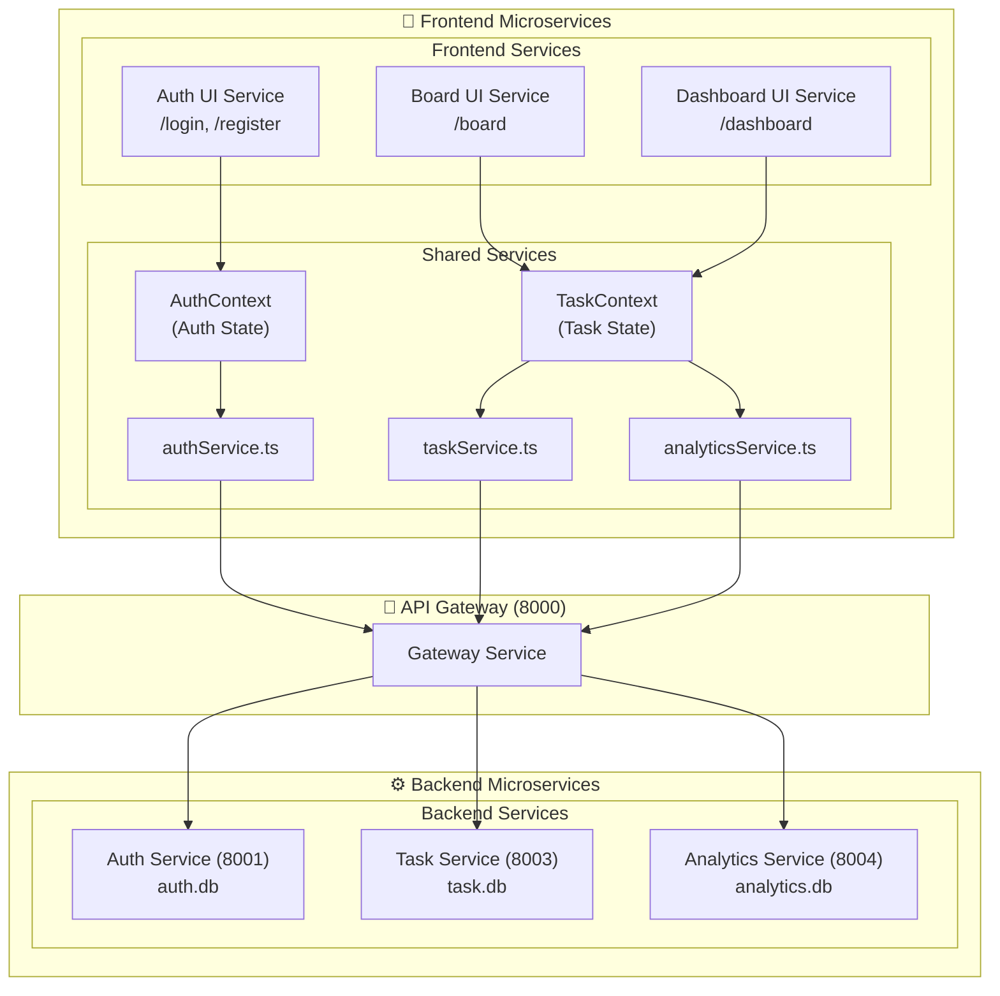

# TaskBoard Pro 3.0 - Microservices Architecture

## Overview
Full microservices architecture. Both backend and frontend are composed of independent, deployable services with fault isolation.

## Architecture Diagram



## Backend Microservices

### 1. API Gateway (Port 8000)
**Responsibility**: Single entry point, routes requests
- All frontend requests go through here
- Forwards to appropriate backend service

### 2. Auth Service (Port 8001)
**Database**: `auth.db`
**Responsibility**: Authentication, JWT
- `POST /auth/register`
- `POST /auth/login`
- `GET /auth/me`
- `GET /auth/verify`

### 3. Task Service (Port 8003)
**Database**: `task.db`
**Responsibility**: Task CRUD
- `GET /tasks`
- `POST /tasks`
- `PUT /tasks/{id}`
- `DELETE /tasks/{id}`
- `PATCH /tasks/{id}/move`

### 4. Analytics Service (Port 8004)
**Database**: `analytics.db`
**Responsibility**: Statistics
- `GET /analytics/stats`
- `GET /analytics/heatmap`
- `GET /analytics/distribution`

## Frontend Microservices

### UI Services (Pages)
| Service | Route | Responsibility |
|---------|-------|----------------|
| Auth UI | `/login`, `/register` | Login/registration forms |
| Board UI | `/board` | Kanban board view |
| Dashboard UI | `/dashboard` | Analytics dashboard |

### Shared Services
| Service | Responsibility |
|---------|----------------|
| `authService.ts` | Auth API calls |
| `taskService.ts` | Task API calls |
| `analyticsService.ts` | Analytics API calls |
| `AuthContext` | Auth state management |
| `TaskContext` | Task state management |

## Fault Isolation

| Service Down | Frontend Impact | Backend Impact |
|-------------|-----------------|----------------|
| Gateway | Full outage | - |
| Auth Service | Can't login | - |
| Task Service | Board broken | - |
| Analytics Service | Dashboard shows error | - |

## Database Isolation

| Service | Database | Contains |
|---------|----------|----------|
| Auth | `auth.db` | Users, passwords |
| Task | `task.db` | Tasks only |
| Analytics | `analytics.db` | Stats cache |

## Ports

| Service | Port |
|---------|------|
| Gateway | 8000 |
| Auth | 8001 |
| Task | 8003 |
| Analytics | 8004 |
| Frontend | 3000 |

## Project Structure

```
taskboard-3.0/
├── gateway/                    # API Gateway
├── services/
│   ├── auth-service/          # Auth microservice
│   ├── task-service/         # Task microservice
│   └── analytics-service/    # Analytics microservice
└── frontend/                  # Frontend microservices
    ├── app/
    │   ├── login/
    │   ├── register/
    │   ├── board/
    │   └── dashboard/
    ├── services/             # API client services
    ├── context/              # State services
    └── components/           # Shared UI components
```

## Version
3.0.0 (Full Microservices)
