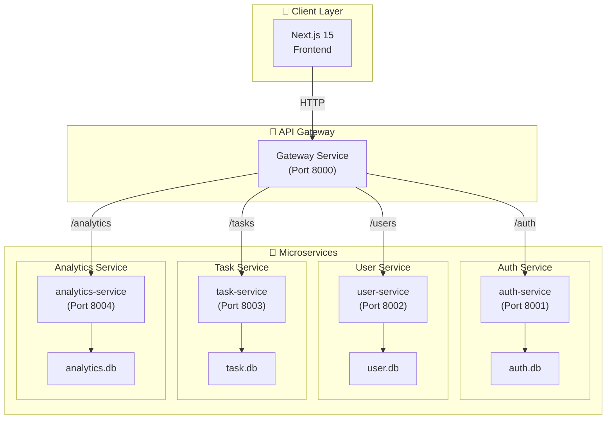

# TaskBoard Pro 3.0 - Microservices Architecture

## Overview
Migration from Monolith to Microservices architecture. Each service is independent, deployable, and fault-isolated.

## Architecture Diagram



## Service Specifications

### 1. API Gateway Service (Port 8000)
**Responsibility**: Single entry point, routing, authentication forwarding
- Routes requests to appropriate microservices
- Adds common headers
- Rate limiting (optional)
- Request validation

### 2. Auth Service (Port 8001)
**Responsibility**: Authentication, JWT token management
- `POST /auth/register` - User registration
- `POST /auth/login` - Get JWT token
- `POST /auth/refresh` - Refresh token
- `GET /auth/verify` - Verify token
- Own database: `auth.db`

### 3. User Service (Port 8002)
**Responsibility**: User profile management
- `GET /users/me` - Get current user
- `PUT /users/me` - Update profile
- `DELETE /users/me` - Delete account
- Own database: `user.db`

### 4. Task Service (Port 8003)
**Responsibility**: Kanban task CRUD operations
- `GET /tasks` - List user tasks
- `POST /tasks` - Create task
- `GET /tasks/{id}` - Get task
- `PUT /tasks/{id}` - Update task
- `DELETE /tasks/{id}` - Delete task
- `PATCH /tasks/{id}/move` - Move task
- Own database: `task.db`

### 5. Analytics Service (Port 8004)
**Responsibility**: Dashboard statistics
- `GET /analytics/stats` - Get user statistics
- `GET /analytics/heatmap` - Priority heatmap data
- `GET /analytics/distribution` - Status distribution
- Own database: `analytics.db`

## Fault Isolation

| Service Down | Impact | Recovery |
|-------------|--------|----------|
| Gateway | Full outage | Restart gateway |
| Auth Service | Can't login | Restart auth |
| User Service | Can't view profile | Restart user |
| Task Service | Can't manage tasks | Restart task |
| Analytics | Dashboard fails | Restart analytics |

## Database Isolation
Each service has its own SQLite database:
- `auth.db` - Authentication data only
- `user.db` - User profiles only
- `task.db` - Tasks only
- `analytics.db` - Cached stats only

## Project Structure

```
taskboard-3.0/
├── gateway/                 # API Gateway
│   ├── main.py
│   ├── requirements.txt
│   └── .env
├── services/
│   ├── auth-service/        # Auth microservice
│   ├── user-service/        # User microservice
│   ├── task-service/        # Task microservice
│   └── analytics-service/   # Analytics microservice
├── frontend/               # Next.js frontend
└── docker-compose.yml      # Orchestration
```

## Ports Mapping

| Service | Port |
|---------|------|
| Gateway | 8000 |
| Auth | 8001 |
| User | 8002 |
| Task | 8003 |
| Analytics | 8004 |
| Frontend | 3000 |

## Version
3.0.0 (Microservices Release)
